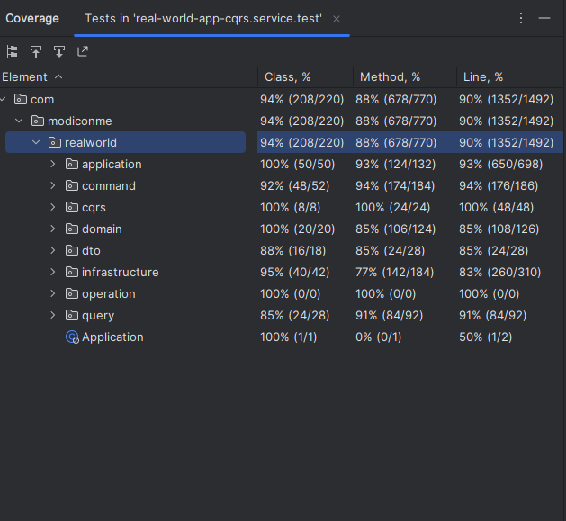

> ### Spring Boot application

Приложение разработано на основе спецификации [real-world-app](https://realworld-docs.netlify.app/docs/specs/backend-specs/endpoints).

### Highlights
- Приложение построено на основе CQRS (command query responsibility segregation) архитектуры
- Security построено на основе jwt токенов
- Обработка исключений с помощью @ControllerAdvice
- Микросервис состоит из 3 модулей (api, bus, service)
- openfeing based integration tests

Также:
* [endpoints and json examples](https://realworld-docs.netlify.app/docs/specs/backend-specs/endpoints)
* [api json answer formats](https://realworld-docs.netlify.app/docs/specs/backend-specs/api-response-format)

### Technology
- Spring Boot 3.0.1 и Java 17
- Spring Data JPA + Hibernate + H2-database
- Spring Security 6 + jwt
- Logback
- Spring Validation для валидации rest запросов
- Jackson для сериализации и дессериализации запросов и ответов
- JUnit 5 + AssertJ + OpenFeign для тестирования
- Docker для [запуска](#Docker-run) в контейнере из Dockerfile
- GitHub actions в качестве CI (continuous integration)

### Getting started
Требуется Java 17 или выше

    ./gradlew bootRun

Для тестирования работоспособности приложения в браузере http://localhost:8080/api/tags.  
Или же через команду в терминале

    curl http://localhost:8080/api

### Testing

Для запуска тестов следующая команда

    ./gradlew test

Процент покрытия строк кода тестами 90%.

### Docker-run

Для запуска приложения в докер контейнере в корне проекта запускаем команду
для построения докер образа.

`docker build -t real-world-backend:v1 .`

После построения образа создаем и запускаем контейер с помощью docker run

`docker run --name real-world-backend -p 8080:8080 real-world-backend:v1`

### Протестировать локально с официальным frontend'ом

Требуется установить nodejs.

1. Запустить бэкенд из докер образа
2. Запуск фронтэнда:
   1. `cd frontend`
   2. `npm install`
   3. `npm install -g @angular/cli`
   4. `npm run build`
   5. `ng serve --open`
